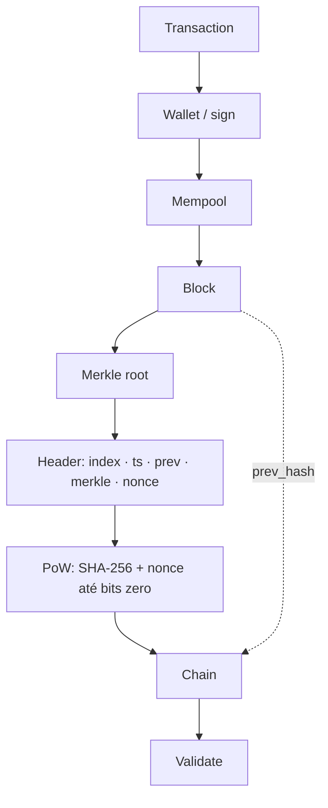
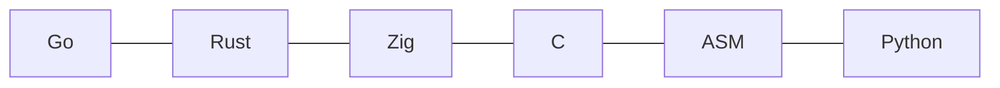
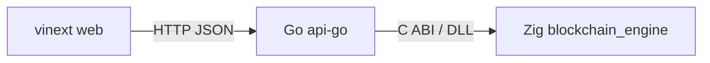

# blockchain-demos

Coleção de demos didáticas de blockchain em várias linguagens, organizadas para
comparar o **mesmo modelo de prova de trabalho** de forma justa.

```
blockchain-demos/          # git root
└── finance/               # demos (finance domain)
    ├── demo-blockchain-with-go/
    ├── demo-blockchain-with-rust/
    ├── demo-blockchain-with-zig/
    ├── demo-blockchain-with-c/
    ├── demo-blockchain-with-asm/
    ├── demo-blockchain-with-python/
    ├── api-go/            # HTTP playground (Go -> Zig)
    └── web/               # vinext UI
```

Demos sob `finance/`. Este repositório contém apenas esses exemplos.

Ideias de extensão e projetos novos: [IDEAS.md](./IDEAS.md). Texto introdutório: [PAPER.md](./PAPER.md).

## Arquitetura (visão didática)

Fluxo clássico das demos (mesmo modelo no bench justo):



Implementações do mesmo modelo em `finance/`:



Coinbase no bench: `from = nil`, `to = pubkey(seed)`, `amount = 50`, `nonce = index`.  
Genesis: `prev = [0;32]`, fora do cronômetro. Por nonce: midstate do header + só o `nonce`.
## Modelo de bench justo

Todas as implementações (no caminho `bench`) usam o **mesmo digest**:

| Aspecto | Detalhe |
|---|---|
| Header | Little-endian: `index \|\| timestamp \|\| prev_hash \|\| merkle_root \|\| nonce` |
| Hash | SHA-256 |
| PoW | Bits zero no início do hash (`leading_zero_bits`) |
| Cache | Prefixo do header absorvido **uma vez**; por nonce só `update(nonce) + final` |
| Genesis | `prev_hash = [0;32]`, minerado fora do cronômetro |
| Coinbase | `from = nil`, `to = pubkey(seed [9;32])`, `amount = 50`, `nonce = index` |
| Timestamps | Fixos: `1700000000 + i` |
| Saída | Uma linha JSON: `{"impl":"…","difficulty":N,"difficulty_unit":"bits",…}` |

Com `difficulty=16, blocks=5, txs_per_block=0` (e `18/3`), os **`hashes` (tentativas)
devem coincidir** entre as linguagens — mesmo trabalho de PoW. O que muda é o
**tempo / hashes_per_sec** (custo de runtime e qualidade do SHA-256).

Endereço do minerador no bench (pubkey Ed25519 de seed `[9;32]`):

`fd1724385aa0c75b64fb78cd602fa1d991fdebf76b13c58ed702eac835e9f618`

## Resultados (após prefix cache)

Rodadas **únicas** em um desktop de desenvolvimento — **não** são um estudo científico
(sem média/desvio, sem isolamento térmico, etc.). Os números ilustram a ordem de
grandeza do HPS com o mesmo workload.

Workload justo: LE + Merkle + bits + midstate. **Hash counts idênticos** em todas.

### difficulty = 16 bits, blocks = 5, txs_per_block = 0

`hashes = 242629` em todas as langs.

| Impl | total_ms | hashes/s (aprox.) |
|---|---:|---:|
| **Zig** | 11 | ~22,1 M |
| **Rust** | 13 | ~17,7 M |
| **Go** (`-bench`) | 27 | ~8,7 M |
| **C** | 58 | ~4,2 M |
| **ASM** | ~58 | ~4,1 M |
| **Python** | 256 | ~0,95 M |

### Recursos (16 bits / 5 blocks) — CPU e RAM

Mesma carga justa (`hashes = 242629`). Medição via amostragem do processo no Windows
(working set pico; CPU% médio de 1 núcleo quando a amostragem captura o intervalo).

| Impl | total_ms | HPS (aprox.) | CPU% médio | Pico RSS |
|---|---:|---:|---:|---:|
| **Zig** | 11 | ~22,1 M | ~1 núcleo\* | ~3,8 MB |
| **Rust** | 13 | ~17,4 M | ~1 núcleo\* | ~4,9 MB |
| **Go** | 28 | ~8,5 M | ~90% | ~13,7 MB |
| **C** | 60 | ~4,0 M | ~98% | ~5,5 MB |
| **ASM** | 62 | ~3,9 M | ~80% | ~5,5 MB |
| **Python** | ~263–270 | ~0,90–0,92 M | ~1 núcleo\* | ~5 MB |

\*Runs muito curtos (<~50 ms) ou resolução de tempo de CPU do OS (~15 ms) limitam a
amostragem: o PoW é single-thread e satura ~1 núcleo; o valor exato de % pode
aparecer como 0 na amostragem. Prefira `total_ms`/`HPS` para ranking de velocidade
e RSS para memória.

### difficulty = 18 bits, blocks = 3, txs_per_block = 0

`hashes = 813846` em todas.

| Impl | total_ms | hashes/s (aprox.) |
|---|---:|---:|
| **Zig** | ~36–39 | ~21–23 M |
| **Rust** | ~45–46 | ~17–18 M |
| **C** | ~194–195 | ~4,2 M |
| **ASM** | ~199 | ~4,1 M |
| **Python** | ~869 | ~0,94 M |

(Ordem estável: **Zig ≳ Rust > Go > C ≈ ASM ≫ Python**.)

## Demos

| Pasta | Linguagem | Notas |
|---|---|---|
| `finance/demo-blockchain-with-go` | Go | API HTTP didática (PoW hex) + `-bench` com digest justo (bits + Merkle binário) |
| `finance/demo-blockchain-with-rust` | Rust | Modelo completo (Ed25519, Merkle, PoW bits); referência do port |
| `finance/demo-blockchain-with-zig` | Zig 0.16 | Mesmo modelo do Rust; só stdlib |
| `finance/demo-blockchain-with-c` | C | Bench justo + midstate; SHA-256 single-file |
| `finance/demo-blockchain-with-asm` | C + x86-64 ASM | Loop de PoW em assembly; midstate; Merkle/CLI em C |
| `finance/demo-blockchain-with-python` | Python 3 | Stdlib `hashlib` + `copy()` para midstate |

## Como testar

```bat
cd finance\demo-blockchain-with-go
go test ./...

cd ..\demo-blockchain-with-rust
cargo test

cd ..\demo-blockchain-with-zig
zig build test

cd ..\demo-blockchain-with-c
zig cc -O3 -std=c11 -DDEMO_IMPL_NAME=\"c\" -Isrc -o demo-blockchain.exe src\sha256.c src\blockchain.c src\main.c
demo-blockchain.exe test

cd ..\demo-blockchain-with-asm
zig cc -O3 -std=c11 -DDEMO_USE_ASM_MINE -DDEMO_IMPL_NAME=\"asm\" -Isrc -o demo-blockchain.exe src\sha256.c src\pow_mine.S src\blockchain.c src\main.c
demo-blockchain.exe test

cd ..\demo-blockchain-with-python
python __main__.py test
```

## Como rodar o bench

Mesmos parâmetros em todas (exemplo Release / otimizado):

```bat
REM Go
cd finance\demo-blockchain-with-go
go build -ldflags="-s -w" -o demo-blockchain.exe .
demo-blockchain.exe -bench -difficulty 16 -blocks 5 -txs-per-block 0

REM Rust
cd ..\demo-blockchain-with-rust
cargo run --release -- bench --difficulty 16 --blocks 5 --txs-per-block 0

REM Zig
cd ..\demo-blockchain-with-zig
zig build run -Doptimize=ReleaseFast -- bench --difficulty 16 --blocks 5 --txs-per-block 0

REM C
cd ..\demo-blockchain-with-c
demo-blockchain.exe bench --difficulty 16 --blocks 5 --txs-per-block 0

REM ASM
cd ..\demo-blockchain-with-asm
demo-blockchain.exe bench --difficulty 16 --blocks 5 --txs-per-block 0

REM Python
cd ..\demo-blockchain-with-python
python __main__.py bench --difficulty 16 --blocks 5 --txs-per-block 0
```

Repita com `--difficulty 18 --blocks 3` (Go: `-difficulty 18 -blocks 3`).

## Notas de comparação (honestas)

1. **Hash counts iguais** (`242629` / `813846`) ⇒ mesmo PoW; compare HPS, não “quem minera mais blocos”.
2. **Prefix cache** importa: sem midstate, C/ASM/Python reprocessam o header a cada nonce e ficam artificialmente lentos.
3. Ordem típica de HPS: **Zig ≳ Rust > Go > C ≈ ASM ≫ Python**.
4. A API HTTP do Go (zeros **hex**, hash JSON) **não** é o mesmo workload do bench — use `-bench` para comparar.
5. `txs_per_block > 0` no C/ASM/Python usa txs dummy sem Ed25519; para paridade use `0`.
6. Números acima são **one-shot** em um desktop — use-os como ilustração, não como ranking definitivo.

## Licença / propósito

Material de estudo e benchmark didático — não é uma blockchain de produção.


## Playground (vinext + Go API + Zig engine)

UI de transferências para experimentar a cadeia didática:

```
finance/web/                     vinext (frontend)
finance/api-go/                  HTTP API em Go (CORS)
finance/demo-blockchain-with-zig motor (shared lib C ABI)
```

Fluxo:



O frontend **não** fala com Zig diretamente. Go só faz gateway (carteiras por nome,
CORS, JSON); assinatura Ed25519, mempool, Merkle, PoW e validação ficam no Zig.

### Como rodar

```bash
# 1) motor Zig
cd finance/demo-blockchain-with-zig
zig build engine -Doptimize=ReleaseFast

# 2) API Go (Windows: carrega blockchain_engine.dll)
cd ../api-go
go run . -addr :8080 -difficulty 12

# 3) frontend
cd ../web
bun install
bun run dev
```

Detalhes: [finance/api-go/README.md](./finance/api-go/README.md) e
[finance/web/README.md](./finance/web/README.md).

As demos CLI/bench em `finance/demo-blockchain-with-*` continuam independentes.
